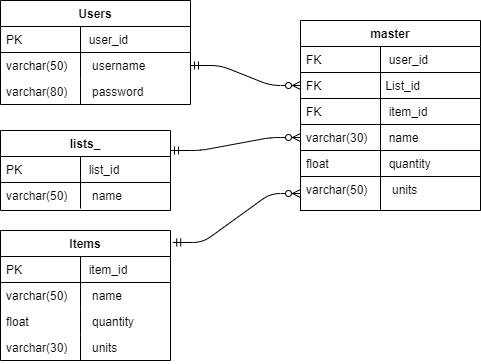
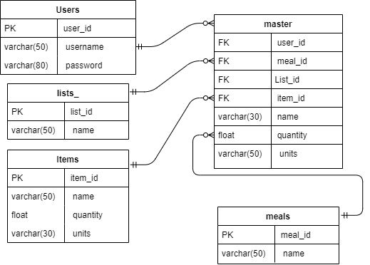
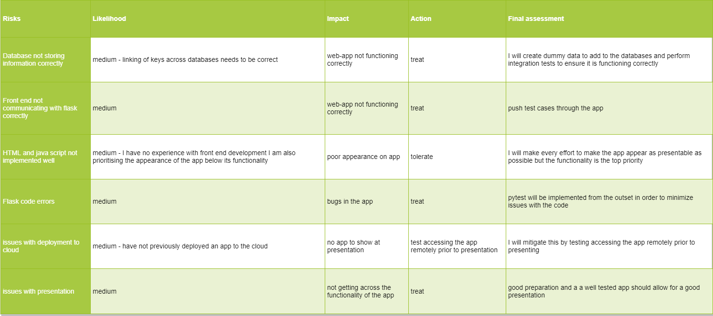

# Shopping list web application

## Brief
The objective of this project is to create a web application in python that has functionality to create, read update and delete information.

## Project
In order to do this I have decided to create an applicaiton that will store shopping lists, this will have a user model that allows users to login and view lists that have been create previously.

### Project Tracking
I have kept track of the projects development using a [trello board](https://trello.com/b/ZqFX1q9P/shopping-list).
initially I created user stories of what I would like the app to do from this, I created checklists inside of those user stories for how to implement each of those features. I then converted each of these items into cards so that the project backlog and progress of each sprint could be monitored.

The project was divided into three sprints, the first sprint covering the requirements outlined in the breif for a minimum required product this app would have functionality for users to log in, create and update one shoppinglist each.

the second sprint would allow users to create multiple shopping lists each.

The third sprint would allow users to add meals to another table and add all the ingredients for each meal to a selected shopping list in one click.

at present I have completed the second sprint and made plans for the third.

### Backend

#### Sprint 1
In order to sore the information in the shopping list I created three mySQL databases these are related as according to the following ERD diagram:

The users table has a one to many relationship with the master table as users will be stored once in the users table and must exist in the users table in order to exist in the master table however there will be multiple instances of each user in the master table (one for each item). Likewise there will only be one instance of each item in the items table but there can be may instances of the same item in the masters table as they may relate to different users.

the master table has been implemented to allow the app to query a database that contains both the user_id and the item_id this makes it possible to return only the items associated with the user that is currently logged in.

#### Sprint 2

During Sprint 2 the Lists_ table was added to the database model in order to allow each user create multiple shopping lists the table structure works similarly to the previous two tables in that the the lists table stores the name of each list once however many instances of each list id can appear in the master table which is ultimately queried in order to display the correct information on the webpage at any given time.

#### Sprint 3

Plans for the third sprint were to add a meals table, this would allow the development of functionality that would allow users to add meals to the app and then add all the ingredients for any given meal to the shopping list in one click. unique instances of each mealname would be stored in the meals table and then multiple instances of this meal id could appear in the master table if more than one user had the same meal name.

### Frontend

The front end of the app was written in HTML with bootstrapp used for formatting, flasks jinja2 syntax was used in order to communicate information between the front end of the app and the python scriptfor instance in order to show each item on a users list, the databse is queried to return all entries that have the users user_id and the list_id of the list currently being viewed. this is then passed as a variable through flask's render_template() function. Using a jinja2 for loop the list is created on the list HTML page by iterating through each item that was returned from the query.

### Risk Assesment 

The below risks have been taken into account prior to the development of the app and have been mitigated where possible.

please click [here](https://github.com/MattCrutchley/shoppinglist/tree/master/images/Risk_assesment.png) for a higher resolution image

### Deployment
The app was deployed to Azure using Jenkins as a CI server, the data is stored in an Azure managed database, webhooks on github trigger Jenkins running a series of tests on a seperate VM, if these are sucsessful another Jenkins job will then run to redeploy the application.

please click [here](https://github.com/MattCrutchley/shoppinglist/blob/mulitilist/images/CI_pipline.jpg) for a higher resolution image

### Cloud infrastructure
please click [here](https://github.com/MattCrutchley/shoppinglist/blob/mulitilist/images/Cloud_infrastructure.jpg) for a higher resolution image

